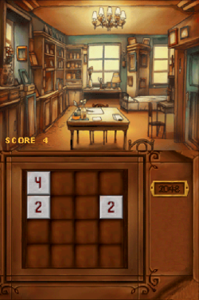

# 2048-nds

2048 puzzle game inspired in Professor Layton using some assets from the game.

<p align="center">

</p>

## Download

[Latest release](https://github.com/mariod8/2048-nds/releases/latest)

## Build

Install [devkitPro](https://devkitpro.org/wiki/devkitPro_pacman). Installation might be different depending on the platform. On Linux and using [pacman](https://wiki.archlinux.org/title/pacman) as the package manager we'll type

```
sudo pacman -Syu nds-dev
```

Then simply run

```
make
```

to compile.

## Acknowledgements

- [libnds](https://github.com/devkitPro/libnds) - C library for Nintendo DS
- [nds_nflib](https://github.com/knightfox75/nds_nflib) - C library for Nintendo DS software development based upon DevkitARM
